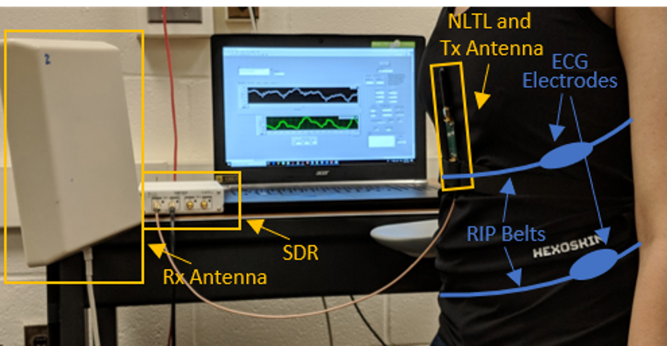

Wearable Near-Field Radio-Frequency Sensor for Cardio-Pulmonary Monitoring
========================================================================================================================================
*Applications of RF near-field coherent sensing (NCS).*

## Near-Field Coherent Sensing [(NCS)](https://www.nature.com/articles/s41928-017-0001-0) Overview
----------------------------------------------------------------------------------------------------------------------------------------

RF NCS can record dielectric boundary movement of internal organs and body surfaces in the near-field region of the transmitter (Tx)
antenna by modulating the carrier. For a harmonic tag, the RF schematic is shown below. NCS is extracted as the modulated I-Q amplitude and phase.

  

NCS can be implemented as either a passive or active setup, with the Tx antenna on the chest, with optimal placement to get vital signs of interest (heart or breath or both). For the former setup, passive radiofrequency identification (RFID) tags can be put on the subject's clothes to maximize the wearer's comfort and minimize the tag cost, while the receiver (Rx) can get the vital signs in the far field. Mechanical movements that result in dynamic dielectric boundary changes are modulated onto the radio signals with unique digital identification (ID), which can be readily extended to monitor multiple tags and persons by a single RFID reader with good channel isolation. In the active tag approach, both Tx and Rx antennas are placed on the chest as a self-contained mobile unit without the need for an external reference reader, which is then feasible for both indoor and outdoor applications. NCS is less sensitive to wearer movement and ambient motion which can be filtered out as the common-mode signal and is thus more feasible for continuous monitoring. 

As this setup provides comfortable non-invasive vital sign monitoring, it can be used for long-term monitoring. Among others, it can help improve diagnostics of respiratory diseases and sleep apnea, which can often be undetected and untreated due to a lack of continuous monitoring. With the ease of placing two independent sensors, we can easily differentiate thorax and abdomen breathing patterns to identify obstructive sleep apnea (OSA) by its thoracoabdominal asynchrony. 

*I have estimated two key respiratory parameters: respiratory rate (RR) and respiratory volume (RV) that can identify various respiratory dynamics and also compared with reference signals derived from airflow pneumotach and calibrated chest belts. Additionally, my work demonstrated accurate heart rate variability (HRV) features from NCS, and novel respiration variation features, used for attention vs relaxed user state detection.*

## Projects
----------------------------------------------------------------------------------------------------------------------------------------

* **Respiratory Volume (RV), Respiratory Rate (RR) Estimation and Apnea Detection [[1](https://doi.org/10.1109/EMBC.2019.8857870), [2](https://www.nature.com/articles/s41746-020-0307-6)]**
	- Performed 30-subject data collection and analysis with various postures and different simulated breathing conditions, coughing, and speaking.
  	- Used LabView interface to provide prompts to users for each task.
  	- One NCS sensor near xiphoid process is used for detecting central sleep apnea (CSA) and observing respiratory-disordered breathing like Cheyne-Stokes, Biot's, Ataxic and Kussmaul breathing.
  	- We further observed separate thoracic and abdominal breathing patterns, present in obstructive sleep apnea (OSA) by placing two NCS sensors near the thorax and abdomen. An isovolumetric maneuver was used to observe opposite thorax and abdomen motions, clearly observed in the below figure.
  	- Implemented the first bed-integrated sensor prototype at *Cornell Weill Sleep Center, NY* for observing sleep apnea in real-world conditions.
  	- Developed robust signal processing tools for extracting HR, RR, and RV from abnormal breathing patterns with a large RR range of 2-40 BrPM.

  

    

  

  

	

   
* **Attention Detection: User attention Detection with NCS Signal-based Heart Rate and Respiratory Rate Variation [[3](https://doi.org/10.3390/s22208047)]**
  * 30 Human subjects performed a Mackworth clock test while wearing RF-NCS sensor to detect attention and vigilance.
  * Used Heart Rate variability and Respiratory Rate Variability features to detect relaxed vs attention states.
  * Observed performances with Leave-one-subject-out vs same-subject training.

* **Motion detection in sleep [[4](https://doi.org/10.1109/MWSYM.2018.8439216)]**

  

  * NCS with synchronized external ECG heartbeat waveform reference.
  * Data was collected with different simulated conditions: at rest, slight jerk, high-energy jerk and slow turning.
  * Data processing is based on training at the rest state, and detects any other motion as an outlier, while not misclassifying if the RF signal is weaker when a person turns. The processing is shown below.
  

  

## Publications
----------------------------------------------------------------------------------------------------------------------------------------
* **P. Sharma**, X. Hui, J. Zhou, T. B. Conroy, E. C. Kan, “Wearable Radio Frequency Sensor for Respiratory Rate, Respiratory Volume and Heart Rate Monitoring,” in _Nature Partner Journal (npj) Digital Medicine_, 2020. [Link](https://www.nature.com/articles/s41746-020-0307-6)
* **P. Sharma**, X. Hui and E. C. Kan, "A wearable RF sensor for monitoring respiratory patterns," in _IEEE Engineering in Medicine and Biology Society (EMBC)_, 2019. [Link](https://doi.org/10.1109/EMBC.2019.8857870)
* **P. Sharma**, Z. Zhang, T. B. Conroy, X. Hui, E. C. Kan, "Attention Detection by Heartbeat and Respiratory Features from Radio-Frequency Sensor," in _Sensors_, 2022. [Link](https://doi.org/10.3390/s22208047)
* **P. Sharma** and E. C. Kan, “Sleep scoring with a UHF RFID tag by near field coherent sensing,” in _IEEE MTT-S Int. Microw. Symp. Dig._, 2018, pp. 1419–1422. [Link](https://doi.org/10.1109/MWSYM.2018.8439216)
* X. Hui and E. C. Kan, “Monitoring vital signs over multiplexed radio by near-field coherent sensing,” _Nat. Electron._, vol. 1, pp. 74–78, 2018. [Link](https://www.nature.com/articles/s41928-017-0001-0)
* X. Hui, **P. Sharma** and E. C. Kan, "Microwave Stethoscope for Heart Sound by Near-Field Coherent Sensing," in _IEEE MTT-S International Microwave Symposium (IMS)_, Boston, MA, June 2 - 7, 2019. [Link](https://doi.org/10.1109/MWSYM.2019.8700904)
* J. Zhou, **P. Sharma**, X. Hui, E. C. Kan, "A Wireless Wearable RF Sensor for Brumation Study of Chelonians," in _IEEE Journal of Electromagnetics, RF and Microwaves in Medicine and Biology_, 2020. [Link](https://doi.org/10.1109/JERM.2020.2998761)
* Z. Zhang, **P. Sharma**, J. Zhou, X. Hui, E. C. Kan, "Furniture-Integrated Respiration Sensors by Notched Transmission Lines," in _IEEE Sensors Journal_, 2020. [Link](https://doi.org/10.1109/JSEN.2020.3028970)
* Z. Zhang, **P. Sharma**, T. B. Conroy, V. Phongtankuel, E. C. Kan, "Objective Scoring of Physiologically Induced Dyspnea by Non-invasive RF Sensors," in _IEEE Transactions on Biomedical Engineering_, 2021. [Link](https://doi.org/10.1109/TBME.2021.3096462)
* X. Hui, J. Zhou, **P. Sharma**, T. B. Conroy, Z. Zhang, E. C. Kan, "Wearable RF Near-Field Cough Monitoring by Frequency-Time Deep Learning," in _IEEE Transactions on Biomedical Circuits and Systems_, 2021. [Link](https://doi.org/10.1109/TBCAS.2021.3099865)
* T. B. Conroy, X. Hui, **P. Sharma**, E. C. Kan, "Heart ID: Biometric Identification Using Wearable MIMO RF Heart Sensors," in _IEEE Journal of Electromagnetics, RF and Microwaves in Medicine and Biology_, 2022. [Link](https://doi.org/10.1109/JERM.2022.3223034)

 

