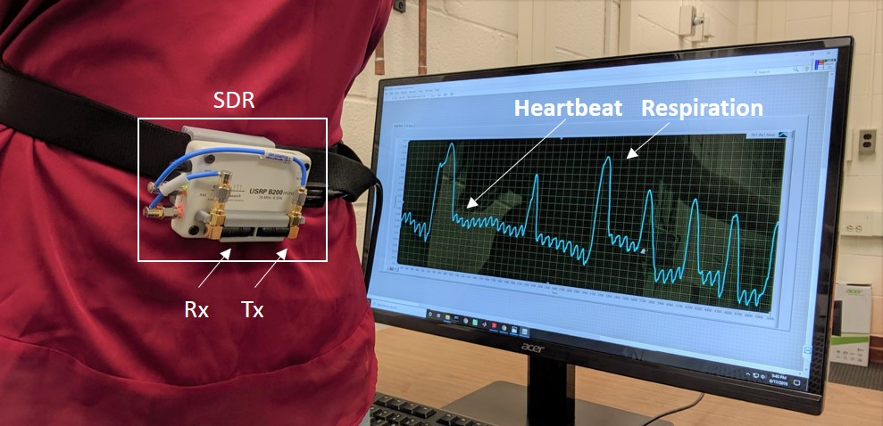
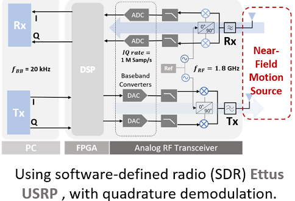
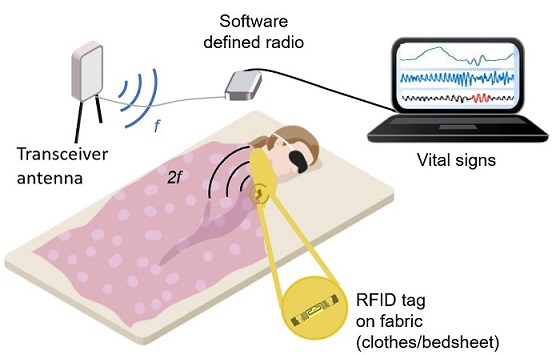
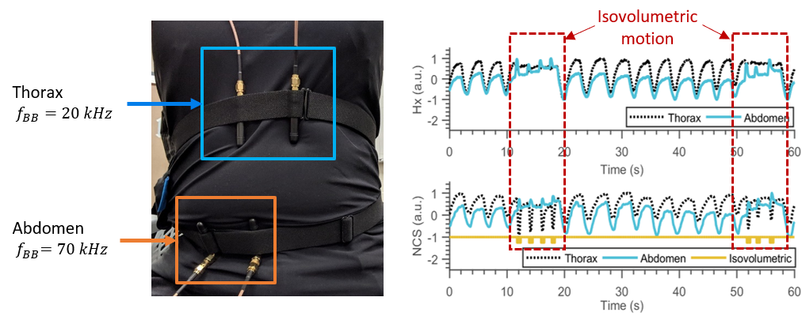
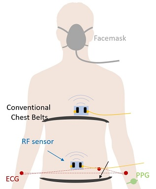

Vital Sign Monitoring by Radio Frequency (RF) Near-Field Coherent Sensing (NCS)
========================================================================================================================================
*Code for applications of radio frequency (RF) based near-field coherent sensing (NCS) in vital sign detection.*

## NCS Overview
----------------------------------------------------------------------------------------------------------------------------------------

RF NCS can record dielectric boundary movement of internal organs and body surfaces in the near-field region of the transmitter (Tx)
antenna by modulating the carrier. For a harmonic tag, RF schematic is shown below. NCS is extracted as the modulated I-Q amplitude and phase.

NCS can be implemented as either passive or active setup, with the Tx antenna on the chest, with optimal placement to get vital sign of interest (heart or breath or both). For the former setup, passive radiofrequency identification (RFID) tags can be put on the person's clothes to maximize the wearer comfort and minimize the tag cost, while receiver (Rx) can get the vital sign in the far-field. Mechanical movements that result in dynamic dielectric boundary changes are modulated onto the radio signals with unique digital identification (ID), which can be readily extended to monitor multiple tags and persons by a single RFID reader with good channel isolation. In the active tag approach, both Tx and Rx antennas are placed on the chest as a self-contained mobile unit without need of an external reference reader, which is then feasible for both indoor and outdoor applications. NCS is less sensitive to wearer movement and ambient motion which can be filtered out as the common-mode signal and is thus more feasible for continuous monitoring. 

As this setup provides comfortable non-invasive vital sign monitoring, it can be used for long-term monitoring. Among others, it can help improve diagnostics of respiratory diseases and sleep apnea, which can often be undetected and untreated due to lack of continous monitoring. With the ease of placing two independent sensors, we can easily differentiate thorax and abdomen breathing patterns to identify obstructive sleep apnea (OSA) by its thoracoabdominal asynchrony. 

We have estimated two key respiratory parameters breath rate (BR) and lung volume (LV) that can identify various respiratory dynamics, and also compared with reference signals derived from airflow pneumotach and calibrated chest belts. Additionally we can also get accurate heart rate variation (HRV) features from NCS that are compared with derived features from reference instruments.

## Measurement devices and data recording software
----------------------------------------------------------------------------------------------------------------------------------------

### [Hexoskin Smart Shirt](https://www.hexoskin.com/) reference 
- Provides following sensors:
	- Fabric-electode Electrocardiogram (ECG)
	- Respiratory Inductance Plethysmography (RIP) chest belts
	- Accelerometer
- Also provides pre-calibrated Tidal Volume (TV) with limited accuracy.

### [BIOPAC](https://www.biopac.com/) reference   
- MP36R 4-channel system.
- Transducers include:
	-3-lead Electrocardiogram (ECG)
	- Stress-based chest belts to be placed on thorax and abdomen.
	- Pre-calibrated pneumotach provides airflow information, that is converted to lung air volume by integration.
	- Finger Photoplethysmograph (PPG).
- Using Biopac Acqknowledge software to read the data and the start timestamp, accurate to seconds.

### Ettus USRP for NCS thorax (near heart) and NCS abdomen measurements (Labview)
* This has updated over the months - initially a Ettus B210 MIMO was implemented with same carrier frequency and different IF for thorax and abdomen NCS measurements. This MIMO was baseband synchronized.
* This setup also used a mic to record audio data (required by the study protocol, removed in following setup due to time constraint).
* The abdomen sensor was much affected by motion of the wire. So setup updated to work with more portable B200mini.
* The new Labview code is updated version that includes software synchronization of NCS thorax and abdomen data coming from different SDR units (for eg., two B200 minis, or one B200 mini and one B200).
* These two-independent units are used with different carrier frequencies for thorax (1.82 GHz) and abdomen (1.9 GHz), with same IF (51 kHz). 
* Labview code saves NCS data at 50kHz for each study routine automatically when selected, with start time-stamp accurate to milliseconds.
* Synchronized audio and visual instructions for performing the routines along with viusal timer.

## Lung Volume, Breath Rate, Heart Rate, Heart Rate Variation Analysis
------------------------------------------------------------------------------------------------------------
### Volume Estimation

Lung volume is an important parameter to be measured for respiratory health monitoring. We can estimate instantaneous volume of air being exchanged by the lungs by calibrating the respiratory motion detected by the NCS.  
* Hexoskin provides pre-calibrated tidal volume, TV (lung volume only during normal breathing) estimate @1Hz sampling rate. 
* With Biopac airflow, we can get more accurate instantaneous volume information by integrating the airflow for each respiration cycle.
* Airflow waveform shows positive airflow during inspiration and negative airflow during expiration, with zero-crossing (ZC) at the inspire/expire transition. 
* This waveform is noisy and may have several ZC near the actual ZC, and needs accurate detection, this is implemented in zeroCrossDet.m. Following the volume estimation, we fit this volume to calibrate Biopac belts.
* NCS is calibrated (small calibration period of <10s) using the reference volume estimate (instantaneous volume with Biopac, and per breath volume with Hexoskin). Calibration involves fitting equations, with linear or quadrativ fitting (we have tried both, with linear being more accurate for most cases), using least-square fitting implemented by Matlab toolbox.

### Peak Detection

* Several peak detection algorithms have been tried, with mimimum tuning parameters and efficient peak detection for non-stationary respiration waveforms, specially with the presence of different breathing (normal, slow-deep, fast breathing and breath hold durations).
* Earlier codes have used Automated Multiscaled Based Peak Detection (AMPD) algorith. 
* For newer versions, I've switched to a semi-automated method, W. Lu, "A semi-automatic method for peak and valley detection in free-breathing respiratory waveforms.". It has slightly more tuning parameters, but they stay fix (unless the frequency varation is huge, say breathing and heartbeat).
* Refer to above source for this algorithm, slight modifications have been made to implement this algorithm, which works well and provides both maxima and minima peaks with identifying information to distinguish maxima with minima.

### Heart Rate Variation

* We have estimated RR interval using both NCS and ECG and calculated HRV features including
	* mean RR (or NN) interval (mean of RR interval, ms)
	* SDNN (Standard deviation of NN interval, ms)
	* RMSSD (Square-root of the mean of the sum of the squares of differences between *adjacent* NN intervals)
	* SDSD (Standard-deviation of the differences between *adjacent* NN intervals)
	* pNN50 (Number of pairs of *adjacent* NN intervals differing by more than 50ms, divided by total number of all NN intervals)
	* LF power (Power in 0.04-0.15 Hz)
	* HF power (Power in 0.15-0.7 Hz)
	* 2D LF/HF graph
* We have tried both fundamental and harmonic NCS to estimate RR interval, as peak from Harmonic is much more accurate, but with *low* SNR.

## Projects
----------------------------------------------------------------------------------------------------------------------------------------
This folder orgainization is in terms of progress of the project. Initially individual components were focused (following are listed in the order oldest to current projects):
* **Motion detection in sleep [1]**

  * NCS with synchronized external ECG heartbeat waveform (reference instrument only added towards the end of this work, so the paper does not have refernce HR during motion corrected phase).
  * Data was collected with different simulated conditions: at rest, slight jerk, high-energy jerk and slow turning.
  * Data processing is based on training at the rest state, and detect any other motion as outlier, while not misclassifying if the signal is weaker when a person turns. The processing is shown below.
  

* **Respiratory (Normal Breathing)**
  * Hexoskin smart shirt is used for majority of this work as reference. 
  * Reference measurements from Hexoskin: ECG heart, thorax and abdomen chest belts respiration with calibrated lung volume estimate.
  * Focusing on normal breathing peak detection using modified Automated Multiscale Peak Detection (AMPD) algorithm, that is mostly automated, with no manually tuned threshold parameters.
  * Estimating lung volume by volume calibration, 
  * HR and BR estimation following the peak detection.

* **Respiratory (Breath Pattern, Coughing, Speaking) [2]**
  * Performing data collection and analysis with different simulated breathing conditions, coughing and speaking.
  * One NCS sensor, near xiphoid process is used for detecting central sleep apnea (CSA) and observing respiratory-disordered breathing like Cheyne-Stokes, Biot's, Ataxic and Kussmaul breathing. 
  * We can further observe separte thoracic and abdominal breathing patterns, present in obstructive sleep apnea (OSA) by placing two NCS sensors near thorax and abdomen as shown in the figure.

  

  * Data analysis is similar coding as previous, but these abnormal breathing conditions require some more changes in the HR, BR estimation post-processing, as the peak-detection is prone to error.
  * Added Labview codes (improved versions are in recent folders).
* **Mass Study 2019**

  * This project covers codes from all the previous projects with improved algorithm for peak detection etc.
  * The aim is to test the system for multiple people in multiple postures, hence many updates were needed:
    * Reference instrument is updated to Biopac system.
    * Codes are automated as much as possible, with no tuning needed (once parameters are set) from person-to-person.
    * refer to the Readme of this for further details regarding hardware and code structure. 
* **Attention Test**
  * It includes a psychological test (Mackworth clock test)to detect attention and vigilance.
  * Aim is to compare HRV feature variation during relaxed and attention phases between NCS and reference instrument.
  * The test is written on [PsyToolkit](https://psytoolkit.org) free-available online software.
  * The acknowledgement for the script is [here](https://www.psytoolkit.org/acknowledgements.html).
  
## References
----------------------------------------------------------------------------------------------------------------------------------------
1. P. Sharma and E. C. Kan, “Sleep scoring with a UHF RFID tag by near field coherent sensing,” in IEEE MTT-S Int. Microw. Symp. Dig., 2018, pp. 1419–1422. [Link](https://doi.org/10.1109/MWSYM.2018.8439216)
2. P. Sharma, X. Hui and E. C. Kan, "A wearable RF sensor for monitoring respiratory patterns," in IEEE Engineering in Medicine and Biology Society (EMBC), 2019. [Link](https://doi.org/10.1109/EMBC.2019.8857870)
3. X. Hui and E. C. Kan, “Monitoring vital signs over multiplexed radio by near-field coherent sensing,” Nat. Electron., vol. 1, pp. 74–78, 2018. [Link](https://www.nature.com/articles/s41928-017-0001-0)
